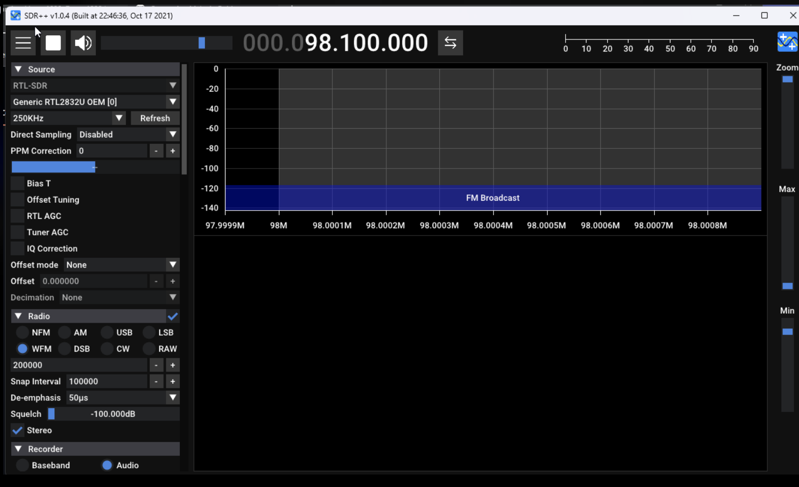
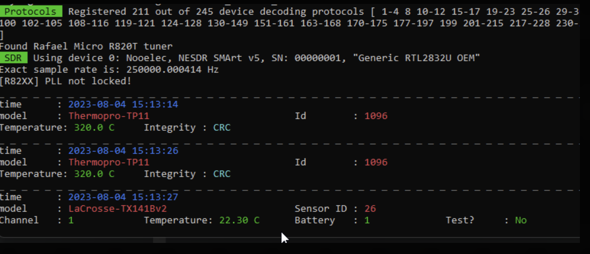

# RTL-SDR

## Starter Kit
The starter kit Cedric recommend is this one: [Neotec Bundle](https://www.amazon.ca/Nooelec-NESDR-SMArt-Bundle-R820T2-Based/dp/B01GDN1T4S/ref=sr_1_1_sspa?crid=QT9RP9QHQU7M&keywords=rtl-sdr&qid=1690984872&sprefix=rtl-sdr%2Caps%2C75&sr=8-1-spons&ufe=app_do%3Aamzn1.fos.b06bdbbe-20fd-4ebc-88cf-fa04f1ca0da8&sp_csd=d2lkZ2V0TmFtZT1zcF9hdGY&psc=1&smid=A2ODZQFKJKWN4I)  
It'll include everything you need for airplane comms

If you also want to go the extra mile to receive amateur radio frequencies more clearly, I'd recommend bundling this too: [Dipole Antenne](https://www.amazon.ca/Telescopic-V%E2%80%91Dipole-Communication-Frequency-Universal/dp/B099X55492/ref=sr_1_52?crid=228MKVBJ1NUW0&keywords=dipole+antenna+sdr&qid=1690984973&sprefix=dipole+antenna+sdr%2Caps%2C66&sr=8-52)

With those two kits you'll be able to jumpstart your "SDR knowledge" quite far  

## Software
Those 2 softwares, best that suits you
- [SDRPP](https://www.sdrpp.org/) 
-  [SDR#](https://airspy.com/download/)
- [RTL_433](https://github.com/merbanan/rtl_433/releases)

For airplanes more specifically, you'll want to install 
 - [dump1090](http://sonicgoose.com/using-dump1090-in-windows/) 
 - [VirtualRadar](https://www.virtualradarserver.co.uk/) 

## How to get started

### Driver 
This assume the kit bought was the starter kit. 
Go [here]([https://www.nooelec.com/store/qs](https://www.nooelec.com/store/qs)) to download the Windows Driver

Once the step are followed, restart the PC.

### SDRPP

Once this is installed and driver up to date. Open SDRPP
It will look like this ->

Source should be changed to RTL-SDR.
Radio to WFM
Select a FM frequency of a Public Radio station to test.

Press the play button.

You should now hear the Station

### RTL_433

Select the release you prefer, nightly or full release.
Extract the ZIP and put somewhere on the PC.

In the Powershell and go to the directory. 
Run  `./rtl_433.exe -f 433975000`

