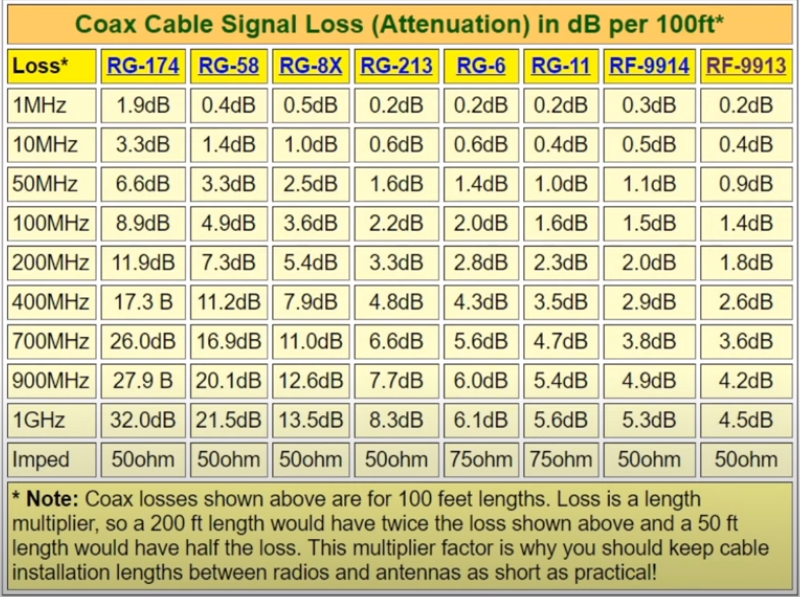
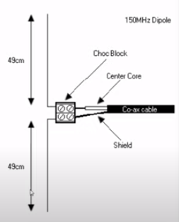
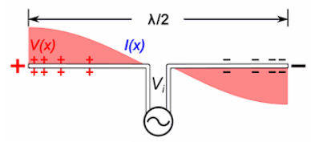

# RTL-SDR

## Starter Kit
The starter kit Cedric recommended is this one: [Neotec Bundle](https://www.amazon.ca/Nooelec-NESDR-SMArt-Bundle-R820T2-Based/dp/B01GDN1T4S/ref=sr_1_1_sspa?crid=QT9RP9QHQU7M&keywords=rtl-sdr&qid=1690984872&sprefix=rtl-sdr%2Caps%2C75&sr=8-1-spons&ufe=app_do%3Aamzn1.fos.b06bdbbe-20fd-4ebc-88cf-fa04f1ca0da8&sp_csd=d2lkZ2V0TmFtZT1zcF9hdGY&psc=1&smid=A2ODZQFKJKWN4I)  
It'll include everything you need for airplane comms

### Included hardware

#### Telescopic antenna mast (variable frequency)

Telescopic antenna. Frequency dependent on set length.

#### 433MHz (ISM) antenna mast (fixed frequency)

Shorter fixed antenna, designed for UHF frequencies (center frequency near 900MHz).

#### UHF antenna mast (fixed frequency)

Longer fixed antenna, designed for 433MHz ISM applications.

If you also want to go the extra mile to receive amateur radio frequencies more clearly, I'd recommend bundling this too: [Dipole Antenne](https://www.amazon.ca/Telescopic-V%E2%80%91Dipole-Communication-Frequency-Universal/dp/B099X55492/ref=sr_1_52?crid=228MKVBJ1NUW0&keywords=dipole+antenna+sdr&qid=1690984973&sprefix=dipole+antenna+sdr%2Caps%2C66&sr=8-52)

With those two kits you'll be able to jumpstart your "SDR knowledge" quite far  

## Software

Those 2 softwares, best that suits you

- [SDRPP](https://www.sdrpp.org/) 
- [SDR#](https://airspy.com/download/)
- [RTL_433](https://github.com/merbanan/rtl_433/releases)

For airplanes more specifically, you'll want to install 

- [dump1090](http://sonicgoose.com/using-dump1090-in-windows/) 
- [VirtualRadar](https://www.virtualradarserver.co.uk/) 

## How to get started

### Driver 

This assume the kit bought was the starter kit.
Go [here](https://www.nooelec.com/store/qs) to download the Windows Driver

Once the step are followed, restart the PC.

### SDRPP

Once this is installed and driver up to date. Open SDRPP
It will look like this ->

Source should be changed to RTL-SDR.
Radio to WFM
Select a FM frequency of a Public Radio station to test.

Press the play button.

You should now hear the Station

### RTL_433

Select the release you prefer, nightly or full release.
Extract the ZIP and put somewhere on the PC.

In the Powershell and go to the directory. 
Run  `./rtl_433.exe -f 433975000`

## How to build an antenna

Best is RG6
Designed for 1Ghz+
Lower price vs performance
75Ohm impedance rather than 50 but not a big issue fro RX only SDRs

## Halfwave Dipole / Vertical FOrmula
[Dipole Calcultor](https://www.omnicalculator.com/physics/dipole)
143 / center freq = X meters
468 / center freq = X ft

| User              | Freq Range  | Centre  | Dipole (m) | Element (cm) |
| ----------------- | ----------- | ------- | ---------- | ------------ |
| Civil Air Band    | 118-137.000 | 127     | 1.12       | 56           |
| Marine Band       | 156-162.150 | 159.065 | 0.9        | 45           |
| 70cm Ham          | 430-450.000 | 440.000 | 0.33       | 16.7         |
| UHF LMR           | 450-470.000 | 460     | 0.31       | 15.5         |
| P25 Public Safety | 769-775.000 | 772     | 0.19       | 9.3          |
|                   |             |         |            |              |
 
 

## Canadian Frequency 
Canadian Table of Frequency Allocations — MHz
| MHz | Frequency Allocations |
| --- | --- |
| 25.67 - 26.1 | BROADCASTING |
| 26.1 - 26.175 | MARITIME MOBILE 5.132 |
| 26.175 - 26.2 | FIXED MOBILE except aeronautical mobile |
| 26.2 - 26.42 | FIXED MOBILE except aeronautical mobile RADIOLOCATION 5.132A |
| 26.42 - 27.5 | FIXED MOBILE except aeronautical mobile 5.150 |
| 27.5 - 28 | MOBILE Fixed |
| 28 - 29.7 | AMATEUR AMATEUR-SATELLITE |
| 29.7 - 30.005 | MOBILE Fixed |
| 30.005 - 30.01 | MOBILE SPACE RESEARCH Fixed |
| 30.01 - 37.5 | MOBILE Fixed |
| 37.5 - 38.25 | MOBILE Fixed Radio astronomy 5.149 |
| 38.25 - 39.986 | MOBILE Fixed |
| 39.986 - 40.02 | MOBILE Fixed Space research |
| 40.02 - 40.98 | MOBILE Fixed 5.150 |
| 40.98 - 41.015 | MOBILE Fixed Space research |
| 41.015 - 50 | MOBILE Fixed |
| 50 - 54 | AMATEUR |
| 54 - 72 | BROADCASTING |
| 72 - 73 | FIXED MOBILE |
| 73 - 74.6 | RADIO ASTRONOMY |
| 74.6 - 74.8 | FIXED MOBILE |
| 74.8 - 75.2 | AERONAUTICAL RADIONAVIGATION 5.180 |
| 75.2 - 76 | FIXED MOBILE |
| 76 - 108 | BROADCASTING |
| 108 - 117.975 | AERONAUTICAL RADIONAVIGATION 5.197A |
| 117.975 - 137 | AERONAUTICAL MOBILE (R) 5.111 5.200 |
| 137 - 138 | METEOROLOGICAL-SATELLITE (space-to-Earth) MOBILE-SATELLITE (space-to-Earth) 5.208A 5.208B 5.209 SPACE OPERATION (space-to-Earth) 5.203C 5.209A SPACE RESEARCH (space-to-Earth) 5.208 |
| 138 - 144 | FIXED LAND MOBILE Space research (space-to-Earth) |
| 144 - 146 | AMATEUR AMATEUR-SATELLITE |
| 146 - 148 | AMATEUR |
| 148 - 149.9 | FIXED LAND MOBILE MOBILE-SATELLITE (Earth-to-space) 5.209 C26 5.218 5.218A 5.219 |
| 149.9 - 150.05 | MOBILE-SATELLITE (Earth-to-space) 5.209 5.220 |
| 150.05 - 156.4875 | MOBILE Fixed 5.226 |
| 156.4875 - 156.5625 | MARITIME MOBILE (distress and calling via DSC) 5.111 5.226 C32 |
| 156.5625 - 156.7625 | MOBILE Fixed 5.226 |
| 156.7625 - 156.7875 | MARITIME MOBILE MOBILE-SATELLITE (Earth-to-space) 5.111 5.226 5.228 |
| 156.7875 - 156.8125 | MARITIME MOBILE (distress and calling) 5.111 5.226 |
| 156.8125 - 156.8375 | MARITIME MOBILE MOBILE-SATELLITE (Earth-to-space) 5.111 5.226 5.228 |
| 156.8375 - 157.1875 | MOBILE Fixed 5.226 |
| 157.1875 - 157.3375 | MOBILE Fixed Maritime mobile-satellite 5.208A 5.208B 5.228AB 5.228AC 5.226 |
| 157.3375 - 161.7875 | MOBILE Fixed 5.226 |
| 161.7875 - 161.9375 | MOBILE Fixed Maritime mobile-satellite 5.208A 5.208B 5.228AB 5.228AC 5.226 |
| 161.9375 - 161.9625 | MOBILE Fixed Maritime mobile-satellite (Earth-to-space) 5.228AA 5.226 |
| 161.9625 - 161.9875 | AERONAUTICAL MOBILE (OR) MARITIME MOBILE MOBILE-SATELLITE (Earth-to-space) 5.228C 5.228D C53 |
| 161.9875 - 162.0125 | MOBILE Fixed Maritime mobile-satellite (Earth-to-space) 5.228AA 5.226 |
| 162.0125 - 162.0375 | AERONAUTICAL MOBILE (OR) MARITIME MOBILE MOBILE-SATELLITE (Earth-to-space) 5.228C 5.228D C53 |
| 162.0375 - 174 | MOBILE Fixed 5.226 |
| 174 - 216 | BROADCASTING |
| 216 - 219 | FIXED MARITIME MOBILE LAND MOBILE 5.242 |
| 219 - 220 | FIXED MARITIME MOBILE LAND MOBILE 5.242 Amateur C11 |
| 220 - 222 | FIXED MOBILE Amateur C11 |
| 222 - 225 | AMATEUR |
| 225 - 312 | FIXED MOBILE 5.111 5.254 5.256 C5 |
| 312 - 315 | FIXED MOBILE Mobile-satellite (Earth-to-space) 5.254 5.255 C5 |
| 315 - 328.6 | FIXED MOBILE 5.254 C5 |
| 328.6 - 335.4 | AERONAUTICAL RADIONAVIGATION 5.258 |
| 335.4 - 387 | FIXED MOBILE 5.254 C5 |
| 387 - 390 | FIXED MOBILE Mobile-satellite (space-to-Earth) 5.208A 5.208B 5.254 5.255 C5 |
| 390 - 399.9 | FIXED MOBILE 5.254 C5 |
| 399.9 - 400.05 | MOBILE-SATELLITE (Earth-to-space) 5.209 5.220 5.260A 5.260B C19 |
| 400.05 - 400.15 | STANDARD FREQUENCY AND TIME SIGNAL-SATELLITE (400.1 MHz) 5.261 |
| 400.15 - 401 | METEOROLOGICAL AIDS METEOROLOGICAL-SATELLITE (space-to-Earth) MOBILE-SATELLITE (space-to-Earth) 5.208A 5.208B 5.209 SPACE RESEARCH (space-to-Earth) 5.263 Space operation (space-to-Earth) 5.264 |
| 401 - 402 | METEOROLOGICAL AIDS SPACE OPERATION (space-to-Earth) EARTH EXPLORATION-SATELLITE (Earth-to-space) METEOROLOGICAL-SATELLITE (Earth-to-space) Fixed Mobile except aeronautical mobile 5.264A 5.264B |
| 402 - 403 | METEOROLOGICAL AIDS EARTH EXPLORATION-SATELLITE (Earth-to-space) METEOROLOGICAL-SATELLITE (Earth-to-space) Fixed Mobile except aeronautical mobile 5.264A 5.264B |
| 403 - 406 | METEOROLOGICAL AIDS Fixed Mobile except aeronautical mobile 5.265 |
| 406 - 406.1 | MOBILE-SATELLITE (Earth-to-space) 5.265 5.266 5.267 |
| 406.1 - 410 | MOBILE except aeronautical mobile RADIO ASTRONOMY Fixed 5.149 5.265 |
| 410 - 414 | MOBILE except aeronautical mobile SPACE RESEARCH (space-to-space) 5.268 Fixed |
| 414 - 415 | FIXED SPACE RESEARCH (space-to-space) 5.268 Mobile except aeronautical mobile |
| 415 - 419 | MOBILE except aeronautical mobile SPACE RESEARCH (space-to-space) 5.268 Fixed |
| 419 - 420 | FIXED SPACE RESEARCH (space-to-space) 5.268 Mobile except aeronautical mobile |
| 420 - 430 | MOBILE except aeronautical mobile Fixed C10 |
| 430 - 432 | RADIOLOCATION Amateur |
| 432 - 438 | RADIOLOCATION Amateur Earth Exploration-Satellite (active) 5.279A 5.282 |
| 438 - 450 | RADIOLOCATION 5.285 Amateur 5.284 5.286 |
| 450 - 455 | MOBILE 5.286AA C23 Fixed 5.209 5.286 5.286A 5.286B 5.286C 5.286D C26A C26B |
| 455 - 456 | FIXED MOBILE 5.286AA C23 MOBILE-SATELLITE (Earth-to-space) 5.209 5.286A 5.286B 5.286C C26A C26B |
| 456 - 459 | MOBILE 5.286AA 5.287 C23 Fixed |
| 459 - 460 | FIXED MOBILE 5.286AA C23 MOBILE-SATELLITE (Earth-to-space) 5.209 5.286A 5.286B 5.286C C26A C26B |
| 460 - 470 | MOBILE 5.286AA 5.287 C23 Fixed 5.289 |
| 470 - 608 | BROADCASTING 5.293 5.295 5.297 C24 C24A |
| 608 - 614 | RADIO ASTRONOMY Mobile-satellite except aeronautical mobile-satellite (Earth-to-space) |
| 614 - 698 | FIXED MOBILE BROADCASTING 5.293  5.308A  C24  C24A |
| 698 - 806 | FIXED MOBILE  5.317A  C7 BROADCASTING 5.293 |
| 806 - 890 | MOBILE 5.317A C7 Fixed 5.317 5.318 |
| 890 - 902 | FIXED MOBILE except aeronautical mobile 5.317A C7 Radiolocation C5A 5.318 |
| 902 - 928 | FIXED RADIOLOCATION C5A Amateur Mobile except aeronautical mobile 5.150 |
| 928 - 929 | FIXED MOBILE except aeronautical mobile 5.317A C7 Radiolocation C5A |
| 929 - 932 | MOBILE except aeronautical mobile 5.317A C7 Fixed Radiolocation C5A |
| 932 - 932.5 | FIXED MOBILE except aeronautical mobile 5.317A C7 Radiolocation C5A |
| 932.5 - 935 | FIXED Mobile except aeronautical mobile 5.317A C7 Radiolocation C5A |
| 935 - 941 | MOBILE except aeronautical mobile 5.317A C7 Fixed Radiolocation C5A |
| 941 - 941.5 | FIXED MOBILE except aeronautical mobile 5.317A C7 Radiolocation C5A |
| 941.5 - 942 | FIXED Mobile except aeronautical mobile 5.317A C7 Radiolocation C5A |
| 942 - 944 | FIXED Mobile 5.317A C7 |
| 944 - 952 | FIXED MOBILE 5.317A C7 |
| 952 - 956 | FIXED MOBILE 5.317A C7 |
| 956 - 960 | FIXED Mobile 5.317A C7 |
| 960 - 1 164 | AERONAUTICAL MOBILE (R) 5.327A AERONAUTICAL RADIONAVIGATION 5.328 5.328AA |
| 1 164 - 1 215 | AERONAUTICAL RADIONAVIGATION 5.328 RADIONAVIGATION-SATELLITE (space-to-Earth) (space-to-space)     5.328B 5.328A |
| 1 215 - 1 240 | EARTH EXPLORATION-SATELLITE (active) RADIOLOCATION RADIONAVIGATION-SATELLITE (space-to-Earth) (space-to-space)     5.328B 5.329 5.329A SPACE RESEARCH (active) 5.332 |
| 1 240 - 1 300 | EARTH EXPLORATION-SATELLITE (active) RADIOLOCATION RADIONAVIGATION-SATELLITE (space-to-Earth) (space-to-space)     5.328B 5.329 5.329A SPACE RESEARCH (active) Amateur 5.282 5.331 5.332 5.335 5.335A |
| 1 300 - 1 350 | RADIOLOCATION AERONAUTICAL RADIONAVIGATION 5.337 RADIONAVIGATION-SATELLITE (Earth-to-space) 5.149 5.337A |
| 1 350 - 1 390 | FIXED MOBILE RADIOLOCATION 5.149 5.334 5.338A 5.339 C5 C27 |
| 1 390 - 1 400 | FIXED MOBILE 5.149 5.339 C27B |
| 1 400 - 1 427 | EARTH EXPLORATION-SATELLITE (passive) RADIO ASTRONOMY SPACE RESEARCH (passive) 5.340 5.341 |
| 1 427 - 1 429 | SPACE OPERATION (Earth-to-space) FIXED 5.338A 5.341 |
| 1 429 - 1 452 | FIXED MOBILE 5.338A 5.341 |
| 1 452 - 1 492 | FIXED MOBILE 5.343 BROADCASTING 5.341 5.345 |
| 1 492 - 1 525 | FIXED MOBILE 5.341 |
| 1 525 - 1 530 | MOBILE-SATELLITE (space-to-Earth) 5.208B 5.351A Earth Exploration-Satellite Space operation (space-to-Earth) 5.341 5.351 5.354 |
| 1 530 - 1 535 | MOBILE-SATELLITE (space-to-Earth) 5.208B 5.351A 5.353A Earth Exploration-Satellite 5.341 5.351 5.354 |
| 1 535 - 1 559 | MOBILE-SATELLITE (space-to-Earth) 5.208B 5.351A 5.341 5.351 5.353A 5.354 5.356 5.357 5.357A |
| 1 559 - 1 610 | AERONAUTICAL RADIONAVIGATION RADIONAVIGATION-SATELLITE (space-to-Earth) (space-to-space)     5.208B 5.328B 5.329A 5.341 |
| 1 610 - 1 610.6 | MOBILE-SATELLITE (Earth-to-space) 5.351A AERONAUTICAL RADIONAVIGATION 5.341 5.364 5.366 5.367 5.368 5.372 |
| 1 610.6 - 1 613.8 | MOBILE-SATELLITE (Earth-to-space) 5.351A RADIO ASTRONOMY AERONAUTICAL RADIONAVIGATION 5.149 5.341 5.364 5.366 5.367 5.368 5.372 |
| 1 613.8 - 1 621.35 | MOBILE-SATELLITE (Earth-to-space) 5.351A AERONAUTICAL RADIONAVIGATION Mobile-satellite (space-to-Earth) 5.208B 5.341 5.364 5.365 5.366 5.367 5.368 5.372 |
| 1 621.35 - 1 626.5 | MARITIME MOBILE-SATELLITE (space-to-Earth) 5.373 5.373A MOBILE-SATELLITE (Earth-to-space) 5.351A AERONAUTICAL RADIONAVIGATION Mobile-satellite (space-to-Earth) except maritime mobile-satellite (space-to-Earth) 5.208B 5.341 5.364 5.365 5.366 5.367 5.368 5.372 |
| 1 626.5 - 1 660 | MOBILE-SATELLITE (Earth-to-space) 5.351A 5.341 5.351 5.353A 5.354 5.357A 5.374 5.375 5.376 |
| 1 660 - 1 660.5 | MOBILE-SATELLITE (Earth-to-space) 5.351A RADIO ASTRONOMY 5.149 5.341 5.351 5.354 5.376A |
| 1 660.5 - 1 668 | RADIO ASTRONOMY SPACE RESEARCH (passive) Fixed 5.149 5.341 5.379A |
| 1 668 - 1 668.4 | RADIO ASTRONOMY SPACE RESEARCH (passive) Fixed 5.149 5.341 5.379A |
| 1 668.4 - 1 670 | METEOROLOGICAL AIDS FIXED RADIO ASTRONOMY 5.149 5.341 5.379D 5.379E |
| 1 670 - 1 675 | METEOROLOGICAL AIDS FIXED METEOROLOGICAL-SATELLITE (space-to-Earth) MOBILE except aeronautical mobile 5.341 5.379D 5.379E |
| 1 675 - 1 700 | METEOROLOGICAL AIDS METEOROLOGICAL-SATELLITE (space-to-Earth) 5.289 5.341 |
| 1 700 - 1 710 | FIXED METEOROLOGICAL-SATELLITE (space-to-Earth) 5.289 5.341 |
| 1 710 - 1755 | FIXED MOBILE 5.384A 5.149 5.341 5.385 5.386 |
| 1 755 - 1 780 | FIXED MOBILE 5.384A 5.386 |
| 1 780 - 1 850 | FIXED Mobile 5.384A C5 5.386 |
| 1 850 - 2 000 | FIXED MOBILE 5.384A 5.388A 5.388 5.389B C35 |
| 2 000 - 2 020 | MOBILE MOBILE-SATELLITE (Earth-to-space) 5.351A 5.388 5.389A 5.389C 5.389E C36 |
| 2 020 - 2 025 | FIXED MOBILE 5.388 C37 |
| 2 025 - 2 110 | EARTH EXPLORATION-SATELLITE (Earth-to-space) (space-to-space) FIXED SPACE OPERATION (Earth-to-space) (space-to-space) SPACE RESEARCH (Earth-to-space) (space-to-space) Mobile 5.391 C5 5.392 |
| 2 110 - 2 120 | FIXED MOBILE 5.388A SPACE RESEARCH (deep space) (Earth-to-space) 5.388 |
| 2 120 - 2 180 | FIXED MOBILE 5.388A 5.388 |
| 2 180 - 2 200 | MOBILE MOBILE-SATELLITE (space-to-Earth) 5.351A 5.388 5.389A C36 |
| 2 200 - 2 290 | EARTH EXPLORATION-SATELLITE (space-to-Earth) (space-to-space) FIXED SPACE OPERATION (space-to-Earth) (space-to-space) SPACE RESEARCH (space-to-Earth) (space-to-space) Mobile 5.391 C5 5.392 |
| 2 290 - 2 300 | FIXED SPACE RESEARCH (deep space) (space-to-Earth) Mobile C5 |
| 2 300 - 2 450 | FIXED MOBILE 5.384A 5.394 C34 RADIOLOCATION Amateur 5.150 5.282 5.393 C12 C13 C13A C17 |
| 2 450 - 2 483.5 | FIXED MOBILE RADIOLOCATION 5.150 |
| 2 483.5 - 2 500 | FIXED C38 MOBILE-SATELLITE (space-to-Earth) 5.351A RADIOLOCATION RADIODETERMINATION-SATELLITE (space-to-Earth) 5.398 5.150 5.402 |
| 2 500 - 2 596 | FIXED MOBILE except aeronautical mobile 5.384A 5.416 |
| 2 596 - 2 655 | BROADCASTING FIXED MOBILE except aeronautical mobile 5.384A 5.339 5.416 |
| 2 655 - 2 686 | BROADCASTING FIXED MOBILE except aeronautical mobile 5.384A Earth Exploration-Satellite (passive) Radio astronomy Space research (passive) 5.149 5.416 |
| 2 686 - 2 690 | FIXED MOBILE except aeronautical mobile 5.384A Earth Exploration-Satellite (passive) Radio astronomy Space research (passive) 5.149 |
| 2 690 - 2 700 | EARTH EXPLORATION-SATELLITE (passive) RADIO ASTRONOMY SPACE RESEARCH (passive) 5.340 |
| 2 700 - 2 900 | AERONAUTICAL RADIONAVIGATION 5.337 Radiolocation 5.423 5.424 C14 C54 |
| 2 900 - 3 100 | RADIOLOCATION 5.424A RADIONAVIGATION 5.426 5.425 5.427 |
| 3 100 - 3 300 | RADIOLOCATION Earth Exploration-Satellite (active) Space research (active) 5.149 |
| 3 300 - 3 450 | RADIOLOCATION 5.433 C5 Amateur 5.149 5.282 |
| 3 450 - 3 500 | FIXED MOBILE except aeronautical mobile 5.431A 5.431B Amateur |
| 3 500 - 3 650 | FIXED MOBILE except aeronautical mobile 5.431B 5.434 |
| 3 650 - 3 700 | FIXED MOBILE except aeronautical mobile 5.434 |
| 3 700 - 4 000 | FIXED FIXED-SATELLITE (space-to-Earth) C15A MOBILE except aeronautical mobile |
| 4 000 - 4 200 | FIXED FIXED-SATELLITE (space-to-Earth) |
| 4 200 - 4 400 | AERONAUTICAL MOBILE (R) 5.436 AERONAUTICAL RADIONAVIGATION 5.438 5.437 5.440 |
| 4 400 - 4 500 | FIXED MOBILE 5.440A C25 |
| 4 500 - 4 800 | FIXED FIXED-SATELLITE (space-to-Earth) 5.441 MOBILE 5.440A C16A C25 |
| 4 800 - 4 825 | FIXED MOBILE 5.440A Radio astronomy C25 |
| 4 825 - 4 835 | FIXED MOBILE 5.440A 5.442 5.149 5.443 C25 |
| 4 835 - 4 950 | FIXED MOBILE 5.440A Radio astronomy C25 |
| 4 950 - 4 990 | FIXED MOBILE 5.442 5.149 5.339 5.443 |
| 4 990 - 5 000 | FIXED RADIO ASTRONOMY Space research (passive) 5.149 |
| 5 000 - 5 010 | AERONAUTICAL MOBILE-SATELLITE (R) 5.443AA AERONAUTICAL RADIONAVIGATION RADIONAVIGATION-SATELLITE (Earth-to-space) |
| 5 010 - 5 030 | AERONAUTICAL MOBILE-SATELLITE (R) 5.443AA AERONAUTICAL RADIONAVIGATION RADIONAVIGATION-SATELLITE (Earth-to-space) (space-to-space) 5.328B 5.443B |
| 5 030 - 5 091 | AERONAUTICAL MOBILE (R) 5.443C AERONAUTICAL MOBILE-SATELLITE (R) 5.443D AERONAUTICAL RADIONAVIGATION 5.444 |
| 5 091 - 5 150 | FIXED-SATELLITE (Earth-to-space) 5.444A AERONAUTICAL MOBILE 5.444B AERONAUTICAL MOBILE-SATELLITE (R) 5.443AA AERONAUTICAL RADIONAVIGATION 5.444 |
| 5 150 - 5 250 | FIXED-SATELLITE (Earth-to-space) 5.447A MOBILE except aeronautical mobile 5.446A 5.446B C39B AERONAUTICAL RADIONAVIGATION 5.446 5.447B 5.447C |
| 5 250 - 5 255 | EARTH EXPLORATION-SATELLITE (active) MOBILE except aeronautical mobile 5.446A 5.447F C39B RADIOLOCATION SPACE RESEARCH 5.447D 5.448A |
| 5 255 - 5 350 | EARTH EXPLORATION-SATELLITE (active) MOBILE except aeronautical mobile 5.446A 5.447F C39B RADIOLOCATION SPACE RESEARCH (active) 5.448A |
| 5 350 - 5 460 | EARTH EXPLORATION-SATELLITE (active) 5.448B RADIOLOCATION 5.448D AERONAUTICAL RADIONAVIGATION 5.449 SPACE RESEARCH (active) 5.448C |
| 5 460 - 5 470 | EARTH EXPLORATION-SATELLITE (active) RADIOLOCATION 5.448D RADIONAVIGATION 5.449 SPACE RESEARCH (active) 5.448B |
| 5 470 - 5 570 | EARTH EXPLORATION-SATELLITE (active) MOBILE except aeronautical mobile 5.446A 5.450A C39B RADIOLOCATION 5.450B MARITIME RADIONAVIGATION SPACE RESEARCH (active) 5.448B |
| 5 570 - 5 650 | MOBILE except aeronautical mobile 5.446A 5.450A C39B RADIOLOCATION 5.450B MARITIME RADIONAVIGATION 5.452 |
| 5 650 - 5 725 | MOBILE except aeronautical mobile 5.446A 5.450A C39B RADIOLOCATION Amateur Space research (deep space) 5.282 |
| 5 725 - 5 850 | RADIOLOCATION Amateur 5.150 C39A |
| 5 850 - 5 925 | FIXED FIXED-SATELLITE (Earth-to-space) MOBILE Amateur Radiolocation 5.150 C39C |
| 5 925 - 6 700 | FIXED FIXED-SATELLITE (Earth-to-space) 5.457A 5.149 5.440 5.458 C39F |
| 6 700 - 7 075 | FIXED FIXED-SATELLITE (Earth-to-space) (space-to-Earth) 5.441 C40 5.458 5.458A 5.458B C39F |
| 7 075 - 7 145 | FIXED 5.458 C39F |
| 7 145 - 7 190 | FIXED SPACE RESEARCH (deep space) (Earth-to-space) 5.458 |
| 7 190 - 7235 | EARTH EXPLORATION-SATELLITE  (Earth-to-space) 5.460A 5.460B FIXED SPACE RESEARCH (Earth-to-space) 5.460 5.458 5.459 |
| 7 235 - 7 250 | EARTH EXPLORATION-SATELLITE  (Earth-to-space) 5.460A FIXED 5.458 |
| 7 250 - 7 300 | FIXED-SATELLITE (space-to-Earth) C49 5.461 C50 |
| 7 300 - 7 450 | FIXED FIXED-SATELLITE (space-to-Earth) C49 5.461 C50 |
| 7 450 - 7 550 | FIXED FIXED-SATELLITE (space-to-Earth) C49 METEOROLOGICAL-SATELLITE (space-to-Earth) 5.461A |
| 7 550 - 7 750 | FIXED FIXED-SATELLITE (space-to-Earth) C49 |
| 7 750 - 7 900 | FIXED METEOROLOGICAL-SATELLITE (space-to-Earth) 5.461B |
| 7 900 - 7 975 | FIXED FIXED-SATELLITE (Earth-to-space) C49 5.461 |
| 7 975 - 8 025 | FIXED-SATELLITE (Earth-to-space) C49 5.461 C50 |
| 8 025 - 8 175 | EARTH EXPLORATION-SATELLITE (space-to-Earth) FIXED FIXED-SATELLITE (Earth-to-space) C49 |
| 8 175 - 8 215 | EARTH EXPLORATION-SATELLITE (space-to-Earth) FIXED FIXED-SATELLITE (Earth-to-space) C49 METEOROLOGICAL-SATELLITE (Earth-to-space) |
| 8 215 - 8 400 | EARTH EXPLORATION-SATELLITE (space-to-Earth) FIXED FIXED-SATELLITE (Earth-to-space) C49 |
| 8 400 - 8 500 | FIXED SPACE RESEARCH (space-to-Earth) 5.465 |
| 8 500 - 8 550 | RADIOLOCATION |
| 8 550 - 8 650 | EARTH EXPLORATION-SATELLITE (active) RADIOLOCATION SPACE RESEARCH (active) 5.469A |
| 8 650 - 8 750 | RADIOLOCATION |
| 8 750 - 8 850 | RADIOLOCATION AERONAUTICAL RADIONAVIGATION 5.470 |
| 8 850 - 9 000 | RADIOLOCATION MARITIME RADIONAVIGATION 5.472 |
| 9 000 - 9 200 | RADIOLOCATION AERONAUTICAL RADIONAVIGATION 5.337 5.473A |
| 9 200 - 9 300 | EARTH EXPLORATION-SATELLITE (active) 5.474A 5.474B 5.474C RADIOLOCATION MARITIME RADIONAVIGATION 5.472 5.474 5.474D |
| 9 300 - 9 500 | EARTH EXPLORATION-SATELLITE (active) RADIOLOCATION RADIONAVIGATION SPACE RESEARCH (active) 5.427 5.474 5.475 5.475A 5.475B 5.476A |
| 9 500 - 9 800 | EARTH EXPLORATION-SATELLITE (active) RADIOLOCATION RADIONAVIGATION SPACE RESEARCH (active) 5.476A |
| 9 800 - 9 900 | RADIOLOCATION Earth Exploration-Satellite (active) Fixed Space research (active) 5.478A 5.478B |
| 9 900 - 10 000 | EARTH EXPLORATION-SATELLITE (active) 5.474A 5.474B 5.474C RADIOLOCATION Fixed 5.474D 5.479 |

## Links

[Radio Band](https://www.techtarget.com/searchnetworking/definition/band)
[Canadian Frequency](https://ised-isde.canada.ca/site/spectrum-management-telecommunications/en/learn-more/key-documents/consultations/canadian-table-frequency-allocations-sf10759)
[NOAA](https://jekhokie.github.io/noaa/satellite/rf/antenna/sdr/2019/05/31/noaa-satellite-imagery-sdr.html)
[Signal Identification Guide](https://www.sigidwiki.com/wiki/Signal_Identification_Guide)
[WXtoImg](https://wxtoimgrestored.xyz/)
[CRAQ](https://www.craq.club/index.php/technique/nos-repeteurs)
